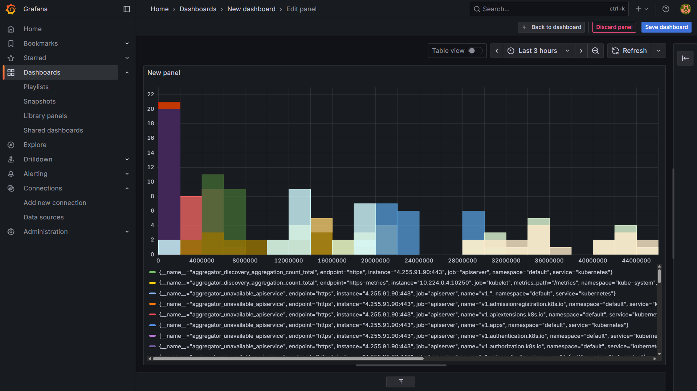
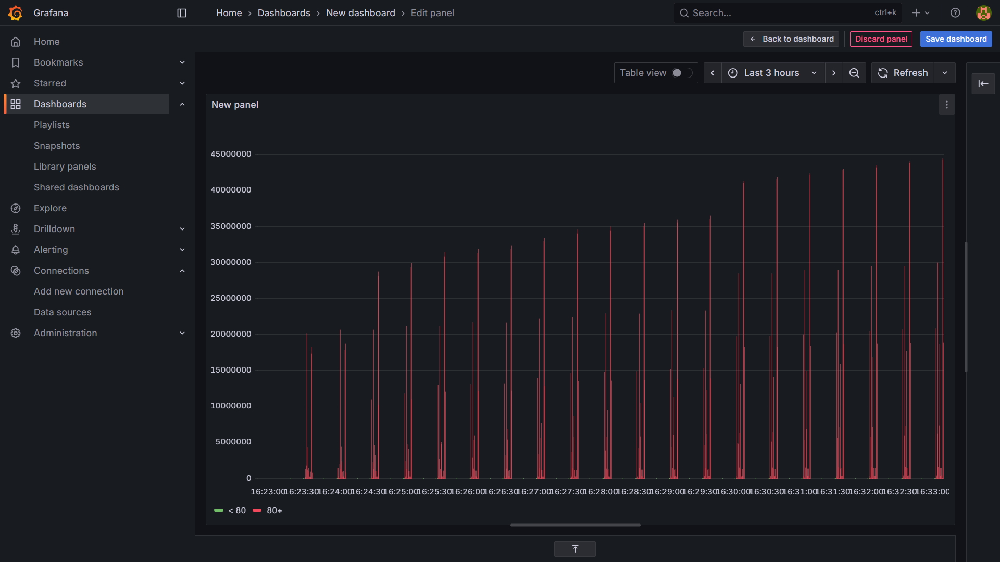

# 📊 SRE Real-Time Monitoring System using Docker, Prometheus, Grafana & GitHub Actions

---

## 📌 Project Overview

This project demonstrates a **SRE-focused monitoring system** that simulates real-time infrastructure metrics using **Prometheus** and **Grafana**, containerized via **Docker**, and deployed automatically using **GitHub Actions CI/CD**.  

The system collects, exposes, and visualizes metrics like **latency**, **availability**, and **error rates**, showcasing best practices in SRE for monitoring, alerting, and observability.

---

## 🛠️ Tools & Technologies

| Tool | Purpose | Link |
|------|---------|------|
| Docker | Containerization & deployment | [Docker](https://www.docker.com/) |
| Prometheus | Metrics collection & SLI/SLO monitoring | [Prometheus](https://prometheus.io/) |
| Grafana | Dashboard visualization | [Grafana](https://grafana.com/) |
| GitHub Actions | CI/CD automation | [GitHub Actions](https://github.com/features/actions) |
| Python & Flask | Backend metrics API | [Flask](https://flask.palletsprojects.com/) |

---

## 🚀 Features

- **Custom Python exporter** to expose metrics from CSV or real-time sources.
- **Prometheus monitoring** with SLI/SLO error tracking.
- **Grafana dashboards** for latency, availability %, and system health.
- **Automated CI/CD pipeline** using GitHub Actions.
- **Dockerized deployment** for reproducible infrastructure.

---

## Screenshots

## ⚡ Getting Started

### Prerequisites

- [Docker](https://www.docker.com/get-started)
- [Python 3.x](https://www.python.org/downloads/)
- [Git](https://git-scm.com/)

### Run Locally

# Clone the repository
git clone <your-repo-link>
cd sre-metrics-monitoring

# Build Docker image
docker build -t sre-monitoring .

# Run Docker container
docker run -p 5000:5000 sre-monitoring
Start Prometheus & Grafana
# Start Prometheus
docker-compose -f prometheus-docker-compose.yml up -d

# Start Grafana
docker-compose -f grafana-docker-compose.yml up -d

📈 CI/CD

Every push to main triggers GitHub Actions workflow:

Builds Docker image

Runs tests

Deploys container

Workflow file: .github/workflows/ci-cd.yml

📊 Dashboard

Grafana dashboard shows:

Latency over time

System availability %

Error rates

Grafana Documentation
